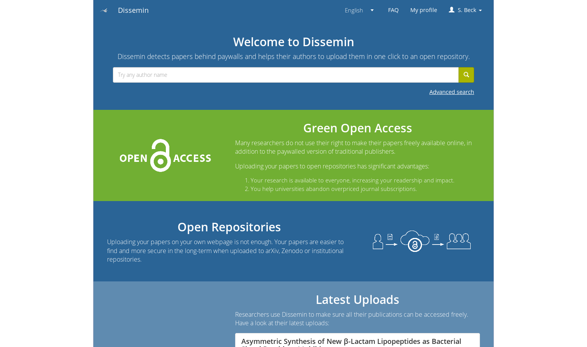

dissem.in
=========

Web platform to help researchers upload their papers to open repositories.

## Getting started

A `Vagrantfile` is provided to quickly set up a VM running dissem.in and start hacking on the code.

* `git clone https://github.com/dissemin/dissemin`
* `cd dissemin`
* `vagrant plugin install vagrant-vbguest` to install the VirtualBox guest additions plugin for Vagrant (if using VirtualBox)
* `vagrant up` to create and provision the VM
* `vagrant ssh` will let you poke into the machine and access its services (PostgreSQL, Redis, ElasticSearch).
A tmux session is running so that you can check out the Celery and Django development server.
You can attach it using `tmux attach`.

Dissem.in will then be available on your host machine at [http://localhost:8080](http://localhost:8080).

Note that, when rebooting the Vagrant VM / container, the Dissemin server will not be started automatically.
To do it, once you have booted the machine, run `vagrant ssh` and then `cd /dissemin && ./launch.sh` and wait for some time until it says that Dissemin has started.
The same holds for other backend services, you can check the very last lines of the
[provisioning/provision.sh](https://github.com/dissemin/dissemin/blob/master/provisioning/provision.sh)
to find out how to start them.

See the [full installation instructions](https://dissemin.readthedocs.io/en/latest/installation/index.html), which include alternative methods.

## Contributing

### Good first issues

A few issues at Github are marked as
["Good first issue"](https://github.com/dissemin/dissemin/issues?q=is%3Aissue+is%3Aopen+label%3A%22good+first+issue%22).
These issues should be easily accessible and fixable without much knowledge about dissem.in internals and should be a good way to start contributing code.

If you feel like working on any open issues ("good first issue" or not), feel free to comment to say that you are working on this and ask details if the issue is
incomplete.

### Localization

Translations are hosted at [TranslateWiki](https://translatewiki.net/wiki/Translating:Dissemin) for an easy-to-use interface for translations and statistics.
We are always looking for translators for all languages.

### Writing an interface for a new repository

Writing an interface for a new repository, so that Dissem.in could upload to this repository, is very easy!

A [full tutorial](https://dissemin.readthedocs.io/en/latest/contributing/writing_new_repository_interface.html) is available.

## Links

* [Project's homepage](https://dissem.in)
* Live support (English/French) on IRC: [irc://irc.ulminfo.fr/#openaccess](irc://irc.ulminfo.fr/#openaccess)
* [Developer Meetings](https://github.com/dissemin/dissemin/wiki)
* [Documentation](https://dissemin.readthedocs.io/en/latest/)
* [To do list](https://github.com/wetneb/dissemin/issues)

## License

dissem.in is released under the [Affero General Public License](http://www.gnu.org/licenses/agpl-3.0.en.html).
Full license is available in the [LICENSE](LICENSE) file.
