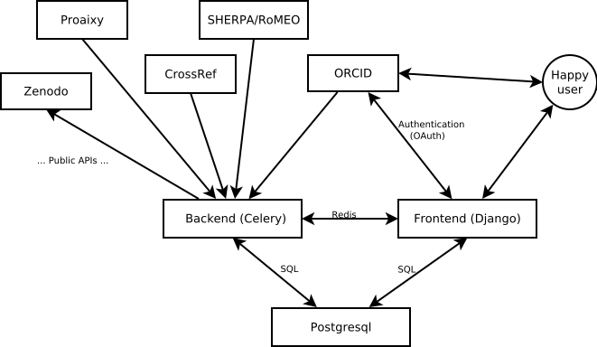

.. _page-datasources:

Data sources
============

Dissemin works with various data sources, providing bibliographic
references, full texts and publisher's policies. Most of these sources
only provide a search API to expose their data: we do not store a copy
of their database but perform calls to their external API when required.
This has the advantage of keeping the local data storage needs very modest,
but fetching the appropriate data from the APIs takes some time.

CrossRef
--------

CrossRef is an association of publishers, mainly in charge of issuing Digital
Object Identifiers (DOIs) for academic publications. DOIs provide many useful
features:

* Redirection to the publication's page on the publisher's website, with links
  of the form `http://dx.doi.org/10.1103/physreve.89.033013 <http://dx.doi.org/10.1103/physreve.89.033013>`_.
  When a publisher changes the structure of its website, tells CrossRef where
  the resources have moved, updating the DOI proxy so that users are redirected
  to the new location.
* Associating metadata to DOIs, in a uniform format. The metadata associated with
  a given DOI can be retrieved using `content negociation <https://en.wikipedia.org/wiki/Content_negotiation>`_. This is useful to get the metadata associated with a DOI that we discover
  from other metadata sources. It works as follows::

    $ curl -LH "Accept: application/citeproc+json" http://dx.doi.org/10.1103/physreve.89.033013 
    {
        "indexed":
        {
            "date-parts": [[2015,6,10]],
            "timestamp": 1433897719282
        },
        "reference-count": 36,
        "publisher": "American Physical Society (APS)",
        "issue": "3",
        "license":[
            {
                "content-version": "vor",
                "delay-in-days": 13,
                "start": {
                    "date-parts": [[2014,3,14]],
                    "timestamp": 1394755200000
                },
                "URL": "http://link.aps.org/licenses/aps-default-license"
            }

        ],
        "DOI": "10.1103/physreve.89.033013",
        "type": "journal-article",
        "source": "CrossRef",
        "title": "Small-scale anisotropic intermittency in magnetohydrodynamic turbulence at low magnetic Reynolds numbers",
        "prefix": "http://id.crossref.org/prefix/10.1103",
        "volume": "89",
        "author": [
            {
                "affiliation": [ ],
                "family": "Okamoto",
                "given": "Naoya"
            },
            {
                "affiliation": [ ],
                "family": "Yoshimatsu",
                "given": "Katsunori"
            },
            {
                "affiliation": [ ],
                "family": "Schneider",
                "given": "Kai"
            },
            {
                "affiliation": [ ],
                "family": "Farge",
                "given": "Marie"
            }

        ],
        "member": "http://id.crossref.org/member/16",
        "container-title": "Physical Review E",
        "link": [
            {
                "intended-application": "syndication",
                "content-version": "vor",
                "content-type": "unspecified",
                "URL": "http://link.aps.org/article/10.1103/PhysRevE.89.033013"
            }
        ],
        "deposited": 
        {
            "date-parts":[[2015,4,13]],
            "timestamp": 1428883200000
        },
        "score": 1,
        "subtitle": [ ],
        "issued": 
        {
            "date-parts":[[2014,3]]
        },
        "URL": "http://dx.doi.org/10.1103/physreve.89.033013",
        "ISSN": 
        [
            "1539-3755",
            "1550-2376"
        ],
        "subject": 
            [
                "Condensed Matter Physics",
                "Statistical and Nonlinear Physics",
                "Statistics and Probability"
            ]
    }

* A search API, basically a machine-readable version of `CrossRef Metadata Search <http://search.crossref.org>`_. Similar metadata is returned for each search result. The documentation can be found `here <https://github.com/CrossRef/rest-api-doc/blob/master/rest_api.md>`_. By searching for an researcher's name and browsing through the few first results pages, we get the metadata for most papers written by that researcher and registered at CrossRef.
  When a researcher is associated with an ORCID id, we also search for papers using their id. This can return papers that do not appear in the ORCID profile (CrossRef has introduced an auto-update feature in 2015
  to populate automatically the profiles, but it is an opt-in feature and only applies to subsequent papers).
  This service only returns DOIs issued by CrossRef, the two other services also work for other DOI
  registration agencies such as DataCite or MEDRA. DataCite offers a similar service but we do not use it as they cover mostly data.

SHERPA/RoMEO
------------

`SHERPA/RoMEO <http://www.sherpa.ac.uk/romeo/>`_ is a service run by `JISC <https://www.jisc.ac.uk/>`_ which provides a semi-structured representation of publisher's self-archiving policies.
They offer `an API <http://www.sherpa.ac.uk/romeo/apimanual.php?la=en&fIDnum=|&mode=simple>`_, whose functionality is very similar to the search service they offer to their regular users.
You can search for a policy by journal or by publisher. Since some publishers have multiple archiving policies, RoMEO recommends to search by journal because it ensures that you will
get the policy in place for this specific journal.

For many journal articles and all conference papers, RoMEO knows the publisher but not the journal, and the metadata returned by CrossRef contains both the journal (or the proceedings title) and the publisher.
We use therefore a two-step approach:

* We search for the journal: if it succeeds, we assign the policy to the paper.
* If it fails, we search for the publisher. If it returns a single result, we assign the policy to the paper.

This is only the big picture: RoMEO has various matching modes (we try first the most restrictive ones), and we also maintain a mapping from CrossRef's publisher names to RoMEO's publisher names (they tend to differ).
TODO describe this

ORCID
-----

ORCID has a public API that can be used to fetch the metadata of all papers ("works") made visible of any ORCID profile (unfortunately, very often, the profiles are empty).
ORCID does not enforce any strict metadata format, which makes it hard to import papers in Dissemin. Specifically, works do not always have a list of authors (which is
a shame given that this service is supposed to solve ambiguity of author names). Even worse, when an authors list is provided, the owner of the ORCID record is almost
never identified in this list.

We try to make the most of the available metadata:

* If a DOI is present, fetch the metadata using content negociation ;
* If a Bibtex version of the metadata is available, parse the Bibtex record to extract the title and author names ;
* Otherwise, if no authors are given, skip the paper.

We then try to find which author is the owner of the ORCID record, using a dedicated name-matching heuristic (:py:func:`papers.name.shallower_name_similarity`).
The name that matches the most the reference name of the ORCID record is assumed to refer to the record's owner.

Proaixy
-------

`Proaixy <https://github.com/wetneb/proaixy>`_ is our own `OAI-PMH <http://www.openarchives.org/OAI/openarchivesprotocol.html>`_ proxy. We use it to discover preprints.
It harvests papers from various OAI-PMH sources (notably the sources handled by `BASE <http://www.base-search.net>`_, see 
`complete list <https://www.base-search.net/about/en/about_sources_date.php>`_) and re-exposes the result in OAI-PMH, adding a few functionalities.

* Search by fingerprint: each paper in Dissemin has a fingerprint, a robust representation of the title, and sometimes the year of publication or the last names of the
  authors. Proaixy enables to fetch all records that match a given fingerprint.
* Search by author name or name signature: a similar feature to search for papers matching a given name.

BASE and CORE
-------------

Interfaces for the search APIs of BASE and CORE have been implemented but are not used anymore. They basically search for a researcher's name and go through the first few
pages of results.

