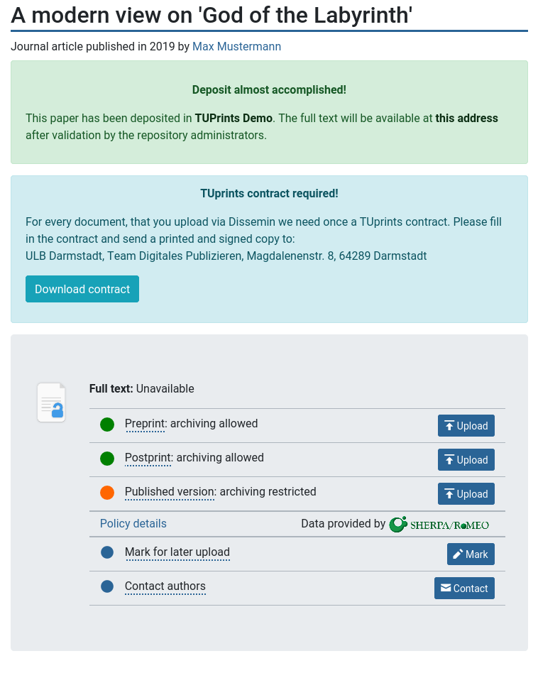
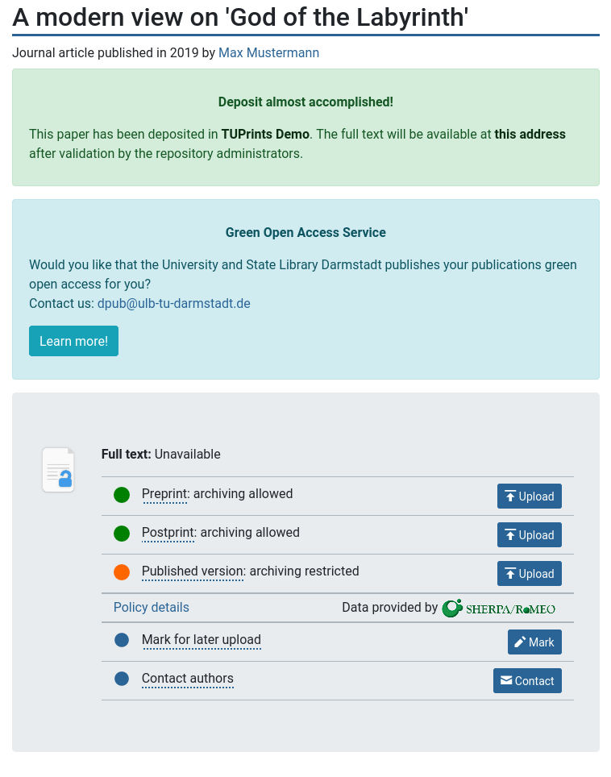

========
Services
========

Services are meant to support your local workflow. 
If you are interested in a new service, please let us know. 

.. _libraries-services-lod:

Letter of Declaration
=====================

Usually institutional repositories require some kind of a letter of declaration from their scientists.
With this letter the scientists declare certain legal statements about the publication and its deposition.

Dissemin can generate these type of letters individually per repository.
This way the letter fits your needs in terms of design, content and legal character.
We can prefill the letter with all necessary data, so that the depositor just has to sign and send you the letter.

Our standard approach is to fill in the form fields of the document.
This way we preserve the legal character, since there are no changes.

After the deposit the depositors are informed that they need to fill in such a letter and send it to your repository administration.
They can directly download this letter.
Of course they can regenerate this letter at any point in time as long you haven't published the resource.

We provide an :download:`example letter of declaratio n<../examples/letter_of_declaration_ulb_darmstadt.pdf>` of ULB Darmstadt, so you have some imagination how it finally looks like.

.. _libraries-services-goa:

Green Open Access Service
=========================

This means a service where the repository administration supports the researchers, e.g. by publishing on behalf of the researchers, which may include checking the rights, get in contact with the publishers and so on.

Dissemin allows to advertise this service after a successful deposit in your repository. The user will get a notification with a short text and a link that describes your service.

